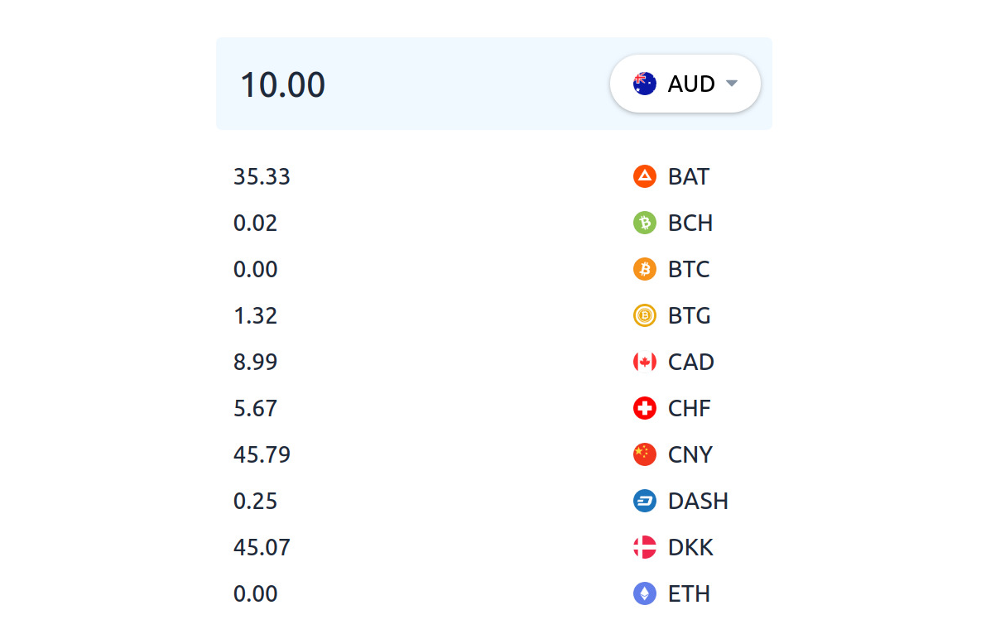

# Currency converter

Converts amount from base currency to other currencies



## Local setup

### Requirements

- [Node.js](https://nodejs.org/en/) version 18+ or 20+

### Install dependencies

```bash
npm install
```

### Run dev environment

```bash
npm run dev
```

Open URL shown in the terminal in the browser

## Tests

### Run tests

```bash
npm run test
```

## Linting

```bash
npm run lint
```

```bash
npm run format
```

## VS Code settings

### Extensions

VS Code recommended extensions is setup in [.vscode/extensions.json](.vscode/extensions.json) file.

To install extensions enter "**Show Recommended Extensions**" in VS Code command pallete.

### Format on save

To format on save use the following config in `.vscode/settings.json`:

```json
{
  "editor.defaultFormatter": "esbenp.prettier-vscode",
  "editor.formatOnSave": true
}
```

## Technical specifications

- Built with [Vite](https://vite.dev/) with [TypeScript](https://www.typescriptlang.org/) and [tailwindcss](https://tailwindcss.com/)
- Using [Uphold SDK](https://github.com/uphold/uphold-sdk-javascript) for currency rates API
- Testing with [Vitest](https://vitest.dev/)
- Linting with [ESLint](https://eslint.org/) and [Prettier](https://prettier.io/)
